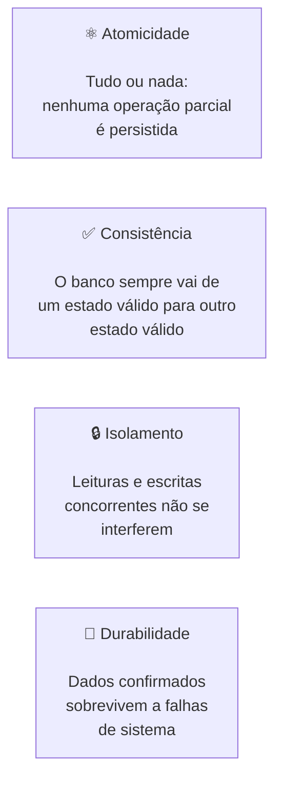

# Delta Lake

## O que é o Delta Lake?

O **Delta Lake** é uma camada de armazenamento open-source que adiciona **transações ACID**,
**controle de versões (Time Travel)** e **esquema aplicável (Schema Enforcement)** ao Apache Spark.
Foi criado pela **Databricks** em 2019 e doado à **Linux Foundation** como projeto open-source.

Ele funciona sobre arquivos **Parquet** comuns, adicionando um diretório de metadados chamado
`_delta_log` que registra todas as operações realizadas na tabela em arquivos JSON numerados
sequencialmente.

---

## Problemas que o Delta Lake resolve

Antes do Delta Lake, os Data Lakes sofriam com problemas sérios que comprometiam a confiabilidade dos dados:

| Problema | Sem Delta Lake | Com Delta Lake |
|----------|---------------|----------------|
| Falha durante escrita | Dados parcialmente escritos (corrompidos) | Rollback automático — tudo ou nada |
| Leitura durante escrita | Resultados inconsistentes | Isolamento snapshot garantido |
| Múltiplos escritores simultâneos | Corrupção silenciosa de dados | Controle otimista de concorrência |
| Alterar registros específicos | Reescrever arquivos inteiros manualmente | `UPDATE` e `DELETE` nativos |
| Auditoria de mudanças | Impossível sem logs externos | `DESCRIBE HISTORY` integrado |
| Schema inconsistente | Colunas erradas aceitas silenciosamente | Schema enforcement automático |

---

## Transações ACID

O Delta Lake garante as quatro propriedades **ACID** para operações em tabelas:



---

## O Diretório `_delta_log`

O segredo do Delta Lake é o **transaction log** armazenado no diretório `_delta_log`.
Cada operação gera um arquivo JSON numerado sequencialmente (com 20 dígitos, zero-padded):

```
spark-warehouse/delta/maquinas_delta/
├── _delta_log/
│   ├── 00000000000000000000.json   ← versão 0: CREATE TABLE
│   ├── 00000000000000000001.json   ← versão 1: INSERT
│   ├── 00000000000000000002.json   ← versão 2: UPDATE
│   └── 00000000000000000003.json   ← versão 3: DELETE
├── part-00000-abc123.snappy.parquet   ← dados versão INSERT
├── part-00000-def456.snappy.parquet   ← dados versão UPDATE
└── ...
```

### Conteúdo de um arquivo de log

Cada JSON no `_delta_log` contém:

- **`add`** — arquivos Parquet adicionados por esta operação
- **`remove`** — arquivos Parquet marcados como removidos (não são deletados fisicamente)
- **`commitInfo`** — metadados: operação, timestamp, parâmetros, usuário

!!! info "Arquivos nunca são deletados imediatamente"
    O Delta Lake apenas marca arquivos como `remove` no log. A deleção física ocorre
    durante o processo de **VACUUM**, que remove arquivos antigos além do período de retenção.

---

## Configuração da SparkSession

```python
from pyspark.sql import SparkSession

try:
    spark.stop()
except:
    pass

spark = (
    SparkSession
    .builder
    .appName("TrabalhoDeltaLake")
    .master("local[*]")
    .config("spark.jars.packages", "io.delta:delta-spark_2.12:3.2.0")
    .config("spark.sql.extensions", "io.delta.sql.DeltaSparkSessionExtension")
    .config(
        "spark.sql.catalog.spark_catalog",
        "org.apache.spark.sql.delta.catalog.DeltaCatalog"
    )
    .config("spark.sql.warehouse.dir", "spark-warehouse/delta")
    .getOrCreate()
)
```

| Configuração | Propósito |
|---|---|
| `spark.jars.packages` | Baixa automaticamente o JAR Delta Lake do Maven Central |
| `spark.sql.extensions` | Habilita sintaxe SQL Delta (`DESCRIBE HISTORY`, `MERGE INTO`) |
| `spark.sql.catalog.spark_catalog` | Substitui o catálogo padrão pelo catálogo Delta |
| `spark.sql.warehouse.dir` | Diretório base onde as tabelas serão armazenadas |

---

## DDL — Criação da Tabela

```sql
-- Remover tabela anterior (idempotência)
DROP TABLE IF EXISTS maquinas_delta;

-- Criar tabela com formato Delta
CREATE TABLE maquinas_delta (
    id     INT,
    tipo   STRING,
    marca  STRING,
    modelo STRING,
    ano    INT,
    preco  DOUBLE,
    status STRING
)
USING delta;
```

!!! info "A cláusula `USING delta`"
    É o que diferencia uma tabela Delta de uma tabela Parquet comum.
    Ela instrui o Spark a criar e manter o `_delta_log` para esta tabela.

---

## DML — Manipulação de Dados

### INSERT

```sql
INSERT INTO maquinas_delta VALUES
(1, 'Escavadeira',      'Caterpillar', '320D', 2018, 350000.00, 'disponivel'),
(2, 'Retroescavadeira', 'JCB',         '3CX',  2020, 280000.00, 'disponivel'),
(3, 'Pa Carregadeira',  'Volvo',       'L90F', 2017, 420000.00, 'disponivel');
```

### SELECT

```sql
SELECT * FROM maquinas_delta ORDER BY id;
```

### UPDATE

```sql
UPDATE maquinas_delta
SET preco  = 265000.00,
    status = 'em_negociacao'
WHERE id = 2;
```

!!! warning "Como o UPDATE funciona internamente"
    1. O Delta lê o arquivo Parquet que contém o registro `id=2`
    2. Gera um **novo arquivo Parquet** com o registro atualizado
    3. Marca o arquivo antigo como `remove` no log
    4. Registra a operação como uma nova versão no `_delta_log`

### DELETE

```sql
DELETE FROM maquinas_delta
WHERE id = 3;
```

---

## Time Travel e `DESCRIBE HISTORY`

O Delta Lake mantém o **histórico completo** de todas as operações realizadas na tabela.

```sql
DESCRIBE HISTORY maquinas_delta;
```

Resultado típico:

| version | timestamp | operation | operationParameters |
|---------|-----------|-----------|---------------------|
| 3 | 2024-01-01 10:03:00 | DELETE | `{"predicate": "[\"id = 3\"]"}` |
| 2 | 2024-01-01 10:02:00 | UPDATE | `{"predicate": "[\"id = 2\"]"}` |
| 1 | 2024-01-01 10:01:00 | WRITE | `{"mode": "Append"}` |
| 0 | 2024-01-01 10:00:00 | CREATE TABLE | `{}` |

### Consultando versões históricas (Time Travel)

```python
# Consultar versão específica por número
df_v1 = spark.read.format("delta") \
    .option("versionAsOf", 1) \
    .table("maquinas_delta")

# Consultar por timestamp
df_antes_update = spark.read.format("delta") \
    .option("timestampAsOf", "2024-01-01 10:01:30") \
    .table("maquinas_delta")

df_v1.show()
```

---

## Recursos Avançados

=== "Schema Evolution"
    O Delta Lake suporta alterações de esquema sem reescrever a tabela:

    ```sql
    -- Adicionar coluna nova
    ALTER TABLE maquinas_delta ADD COLUMN km_rodados INT;

    -- Renomear coluna (requer mapeamento de colunas habilitado)
    ALTER TABLE maquinas_delta RENAME COLUMN tipo TO categoria;
    ```

=== "OPTIMIZE e ZORDER"
    Compacta pequenos arquivos Parquet e organiza os dados para melhorar performance de leitura:

    ```sql
    -- Compactar arquivos pequenos
    OPTIMIZE maquinas_delta;

    -- Compactar e ordenar por coluna de filtro frequente
    OPTIMIZE maquinas_delta ZORDER BY (status);
    ```

=== "VACUUM"
    Remove arquivos físicos marcados como `remove` que estão além do período de retenção:

    ```sql
    -- Remover arquivos com mais de 7 dias (padrão)
    VACUUM maquinas_delta;

    -- Remover arquivos com mais de 24 horas
    VACUUM maquinas_delta RETAIN 24 HOURS;
    ```

=== "MERGE INTO"
    Upsert (INSERT + UPDATE + DELETE em uma única operação atômica):

    ```sql
    MERGE INTO maquinas_delta AS target
    USING novos_dados AS source
    ON target.id = source.id
    WHEN MATCHED THEN
      UPDATE SET target.preco = source.preco,
                 target.status = source.status
    WHEN NOT MATCHED THEN
      INSERT *;
    ```

---

## Vantagens e Desvantagens

=== "Vantagens"
    - ✅ Transações ACID completas sobre Parquet
    - ✅ `UPDATE` e `DELETE` nativos (sem reescrever tudo manualmente)
    - ✅ Time Travel por versão ou timestamp
    - ✅ `DESCRIBE HISTORY` para auditoria
    - ✅ Schema enforcement e evolution
    - ✅ Excelente integração com Databricks e Spark
    - ✅ `OPTIMIZE` e `ZORDER` para performance
    - ✅ `MERGE INTO` para upserts atômicos

=== "Desvantagens"
    - ⚠️ Fortemente ligado ao ecossistema Databricks/Spark
    - ⚠️ `_delta_log` pode crescer muito em tabelas de alta frequência (requer `VACUUM`)
    - ⚠️ Menor suporte de engines não-Spark comparado ao Iceberg
    - ⚠️ Sem hidden partitioning (partições devem ser definidas explicitamente)
