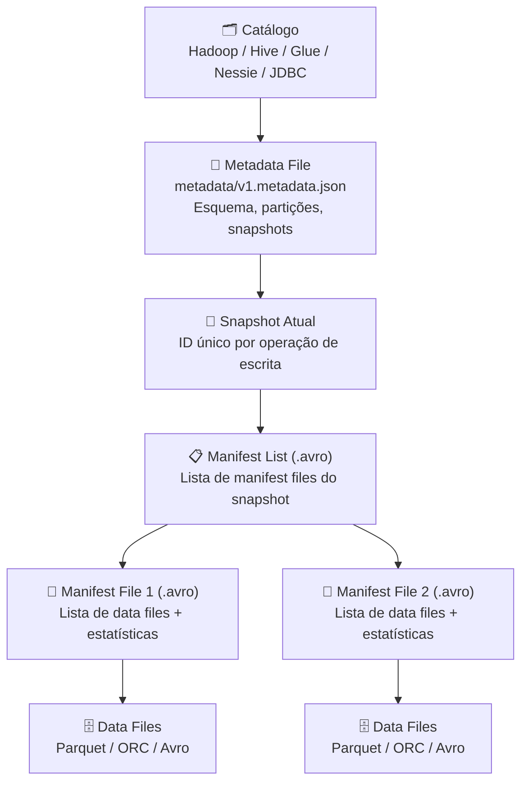
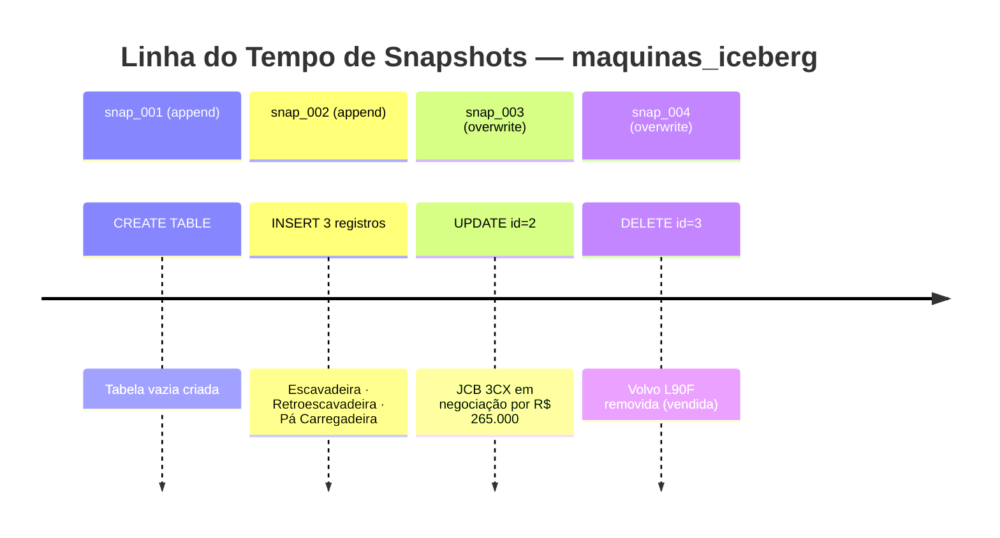

# Apache Iceberg

## O que é o Apache Iceberg?

O **Apache Iceberg** é um formato de tabela aberto para datasets analíticos em grande escala.
Criado pelo **Netflix** em 2017 para resolver problemas de gerenciamento de tabelas petabyte-scale
em produção, foi doado à **Apache Software Foundation** e tornou-se um projeto top-level em 2020.

Ao contrário do Delta Lake — que depende fortemente do ecossistema Spark/Databricks —
o Iceberg é um **formato neutro de engine**: uma especificação aberta que pode ser lida e escrita
por Spark, Flink, Trino, Dremio, Hive, Impala e outros.

---

## Problemas que o Iceberg resolve

O Iceberg foi criado para resolver limitações específicas do Hive que o Netflix enfrentava em produção:

| Problema | Hive tradicional | Apache Iceberg |
|----------|-----------------|----------------|
| Listagem de partições lenta | `O(n)` por arquivo em HDFS | Metadata em arquivos Avro otimizados |
| Schema evolution inseguro | Risco de dados incorretos | Mapeamento de colunas por ID, nunca por nome |
| Partições explícitas | Usuário precisa conhecer o layout | Hidden partitioning — transparente |
| Atomic swaps | Não suportado | ACID por design com snapshots |
| Time Travel | Impossível sem soluções externas | Nativo via snapshot_id ou timestamp |
| Multi-engine | Acoplado ao Hive | Spark, Flink, Trino, Dremio, etc. |

---

## Arquitetura do Iceberg

O Iceberg usa uma hierarquia de metadados em camadas que permite operações eficientes mesmo em
tabelas com bilhões de arquivos:



### Camadas de metadados

| Camada | Formato | Conteúdo |
|--------|---------|----------|
| **Catalog** | (varia) | Mapeia nome da tabela → localização do metadata file |
| **Metadata File** | JSON | Esquema, spec de partição, lista de snapshots |
| **Snapshot** | Referência | Ponteiro imutável para um manifest list |
| **Manifest List** | Avro | Lista de manifest files com estatísticas por partição |
| **Manifest File** | Avro | Lista de data files com min/max por coluna |
| **Data File** | Parquet/ORC/Avro | Os dados reais da tabela |

---

## Snapshots

Cada operação de escrita no Iceberg cria um novo **snapshot** — uma fotografia imutável e
atômica do estado completo da tabela.



### Por que snapshots são poderosos?

- **Imutabilidade** — cada snapshot é permanente e nunca é modificado
- **Time Travel** — consultar qualquer estado histórico da tabela
- **Rollback** — reverter para um snapshot anterior sem perda de dados
- **Auditoria** — rastrear exatamente quando e qual operação foi feita
- **Leituras isoladas** — uma query sempre vê um snapshot consistente

---

## Catálogo Hadoop (Local)

Neste trabalho usamos o **catálogo Hadoop** — o tipo mais simples de catálogo do Iceberg,
que armazena os metadados diretamente no sistema de arquivos sem necessidade de banco externo.

```
spark-warehouse/iceberg/
└── trabalho/
    └── maquinas_iceberg/
        ├── data/
        │   ├── 00000-1-abc123.parquet   ← dados após INSERT
        │   └── 00000-2-def456.parquet   ← dados após UPDATE
        └── metadata/
            ├── v1.metadata.json          ← metadata versão 1 (CREATE)
            ├── v2.metadata.json          ← metadata versão 2 (INSERT)
            ├── v3.metadata.json          ← metadata versão 3 (UPDATE)
            ├── snap-001-abc.avro         ← manifest list do snapshot 1
            └── manifest-001.avro         ← manifest file com lista de data files
```

### Tipos de catálogo Iceberg

| Catálogo | Tipo | Uso típico |
|----------|------|-----------|
| **Hadoop** | `hadoop` | Desenvolvimento local, testes, trabalhos acadêmicos |
| **Hive Metastore** | `hive` | Ambientes Hadoop tradicionais |
| **AWS Glue** | `glue` | AWS (S3 + Athena + EMR) |
| **Project Nessie** | `nessie` | Git-like branching para dados |
| **JDBC** | `jdbc` | PostgreSQL, MySQL como catálogo |
| **REST** | `rest` | Catálogo via API REST (Snowflake Open Catalog) |

---

## Configuração da SparkSession

```python
from pyspark.sql import SparkSession

try:
    spark.stop()
except:
    pass

spark = (
    SparkSession
    .builder
    .appName("TrabalhoIceberg")
    .master("local[*]")
    .config(
        "spark.jars.packages",
        "org.apache.iceberg:iceberg-spark-runtime-3.5_2.12:1.6.1"
    )
    .config(
        "spark.sql.extensions",
        "org.apache.iceberg.spark.extensions.IcebergSparkSessionExtensions"
    )
    .config("spark.sql.catalog.local", "org.apache.iceberg.spark.SparkCatalog")
    .config("spark.sql.catalog.local.type", "hadoop")
    .config("spark.sql.catalog.local.warehouse", "spark-warehouse/iceberg")
    .getOrCreate()
)
```

| Configuração | Propósito |
|---|---|
| `spark.jars.packages` | Baixa o runtime Iceberg para Spark 3.5 / Scala 2.12 |
| `spark.sql.extensions` | Habilita extensões SQL Iceberg (`CALL`, time travel) |
| `spark.sql.catalog.local` | Registra `local` como nome do catálogo Iceberg |
| `spark.sql.catalog.local.type` | `hadoop` = catálogo baseado em sistema de arquivos |
| `spark.sql.catalog.local.warehouse` | Diretório raiz do catálogo |

---

## Nomenclatura de Tabelas

No Iceberg, as tabelas seguem o padrão: `<catálogo>.<database>.<tabela>`

```python
# Criar database (namespace no catálogo Hadoop)
spark.sql("CREATE DATABASE IF NOT EXISTS local.trabalho")

# A tabela será referenciada sempre com o caminho completo
spark.sql("SELECT * FROM local.trabalho.maquinas_iceberg")
```

---

## DDL — Criação da Tabela

```sql
-- Criar database
CREATE DATABASE IF NOT EXISTS local.trabalho;

-- Remover tabela anterior (idempotência)
DROP TABLE IF EXISTS local.trabalho.maquinas_iceberg;

-- Criar tabela com formato Iceberg
CREATE TABLE local.trabalho.maquinas_iceberg (
    id     INT,
    tipo   STRING,
    marca  STRING,
    modelo STRING,
    ano    INT,
    preco  DOUBLE,
    status STRING
)
USING iceberg;
```

---

## DML — Manipulação de Dados

### INSERT

```sql
INSERT INTO local.trabalho.maquinas_iceberg VALUES
(1, 'Escavadeira',      'Caterpillar', '320D', 2018, 350000.00, 'disponivel'),
(2, 'Retroescavadeira', 'JCB',         '3CX',  2020, 280000.00, 'disponivel'),
(3, 'Pa Carregadeira',  'Volvo',       'L90F', 2017, 420000.00, 'disponivel');
```

### SELECT

```sql
SELECT * FROM local.trabalho.maquinas_iceberg ORDER BY id;
```

### UPDATE

```sql
UPDATE local.trabalho.maquinas_iceberg
SET preco  = 265000.00,
    status = 'em_negociacao'
WHERE id = 2;
```

### DELETE

```sql
DELETE FROM local.trabalho.maquinas_iceberg
WHERE id = 3;
```

---

## Consultando Snapshots

O Iceberg expõe metadados de snapshots como **tabelas virtuais** acessíveis via SQL.
Para acessá-las, basta adicionar o sufixo ao nome da tabela:

```sql
-- Histórico de snapshots
SELECT committed_at, snapshot_id, operation
FROM local.trabalho.maquinas_iceberg.snapshots;
```

Resultado típico:

| committed_at | snapshot_id | operation |
|---|---|---|
| 2024-01-01 10:00:00 | 1234567890123 | append |
| 2024-01-01 10:01:00 | 2345678901234 | overwrite |
| 2024-01-01 10:02:00 | 3456789012345 | overwrite |

### Outras tabelas de metadados

| Sufixo | Conteúdo |
|--------|----------|
| `.snapshots` | Histórico de todos os snapshots |
| `.history` | Histórico de mudanças de metadados |
| `.files` | Data files do snapshot atual |
| `.manifests` | Manifest files do snapshot atual |
| `.partitions` | Estatísticas de partições |
| `.refs` | Branches e tags (Iceberg v2) |

### Time Travel com Iceberg

```sql
-- Por snapshot_id
SELECT * FROM local.trabalho.maquinas_iceberg
VERSION AS OF 1234567890123;

-- Por timestamp
SELECT * FROM local.trabalho.maquinas_iceberg
TIMESTAMP AS OF '2024-01-01 10:00:30';
```

---

## Delta Lake vs. Apache Iceberg

| Característica | Delta Lake | Apache Iceberg |
|---|---|---|
| **Criador** | Databricks (2019) | Netflix (2017) |
| **Fundação** | Linux Foundation | Apache Software Foundation |
| **Especificação** | Proprietária (open-source) | Especificação aberta |
| **Metadados** | JSON (`_delta_log`) | JSON + Avro (hierarquia em camadas) |
| **Engines** | Principalmente Spark | Spark, Flink, Trino, Hive, Dremio... |
| **Catálogos** | Unity Catalog, HMS | Hive, Glue, Nessie, JDBC, REST... |
| **Time Travel** | `VERSION AS OF` / `TIMESTAMP AS OF` | `VERSION AS OF` / `TIMESTAMP AS OF` |
| **Schema Evolution** | ✅ | ✅ (mais avançado, por ID de coluna) |
| **Hidden Partitioning** | ❌ | ✅ |
| **Row-level Deletes** | Copy-on-Write | Copy-on-Write + Merge-on-Read |
| **Auditoria** | `DESCRIBE HISTORY` | `.snapshots` / `.history` |
| **Integração Databricks** | Nativa (Unity Catalog) | Suportada |

!!! tip "Qual usar?"
    - Use **Delta Lake** se o seu stack é centrado no Databricks ou Spark.
    - Use **Apache Iceberg** se você precisa de interoperabilidade multi-engine
      (ex: escrever com Spark e ler com Trino/Athena/Flink).
