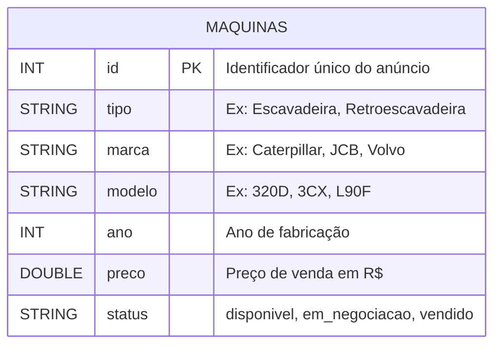

# Apache Spark com Delta Lake e Apache Iceberg

## Contextualização do Trabalho

Este trabalho foi desenvolvido como requisito parcial para a disciplina de **Engenharia de Dados** na Pós-Graduação.
O objetivo é demonstrar na prática o funcionamento dos principais **formatos de tabela abertos** para arquitetura
Data Lakehouse: **Delta Lake** e **Apache Iceberg**, ambos integrados com **Apache Spark / PySpark**.

### Alunos

| Nome | RA |
|------|----|
| [Nome do Aluno 1] | [RA] |
| [Nome do Aluno 2] | [RA] |

**Professor:** Prof. Jorge Lima da Silva

### Repositórios de Referência do Professor

- [spark-delta](https://github.com/jlsilva01/spark-delta)
- [spark-iceberg](https://github.com/jlsilva01/spark-iceberg)

---

## Cenário: Marketplace de Máquinas Pesadas

Para demonstrar as capacidades do **Delta Lake** e **Apache Iceberg**, escolhemos o cenário de um
**marketplace de máquinas pesadas** — uma plataforma digital onde vendedores anunciam máquinas de
construção, mineração e agronegócio para potenciais compradores.

### Por que este cenário?

- **Alto valor por registro** — preços em centenas de milhares de reais exigem rastreabilidade total
- **Status mutável** — um anúncio passa por: `disponivel → em_negociacao → vendido`
- **Auditoria obrigatória** — qualquer alteração de preço ou status precisa ser registrada com histórico
- **Crescimento contínuo** — novos anúncios são inseridos constantemente na plataforma

---

## Modelo de Dados



### Dados de Exemplo

| id | tipo | marca | modelo | ano | preco | status |
|----|------|-------|--------|-----|-------|--------|
| 1 | Escavadeira | Caterpillar | 320D | 2018 | R$ 350.000 | disponivel |
| 2 | Retroescavadeira | JCB | 3CX | 2020 | R$ 280.000 | em_negociacao |
| 3 | Pá Carregadeira | Volvo | L90F | 2017 | R$ 420.000 | disponivel |

---

## Tecnologias Utilizadas

| Tecnologia | Versão | Papel |
|------------|--------|-------|
| Apache Spark | 3.5.3 | Motor de processamento distribuído |
| PySpark | 3.5.3 | API Python para Spark |
| Delta Lake | 3.2.0 | Formato de tabela ACID sobre Parquet |
| Apache Iceberg | 1.6.1 | Formato de tabela aberto com snapshots |
| Python | 3.11 | Linguagem de programação |
| JupyterLab | 4.x | Ambiente interativo de notebooks |
| UV | latest | Gerenciador de pacotes e ambiente Python |
| Java | 17 | Requisito obrigatório do Apache Spark |

---

## Operações Demonstradas

| Operação | Delta Lake | Apache Iceberg |
|----------|:----------:|:--------------:|
| `CREATE TABLE` | ✅ | ✅ |
| `INSERT INTO` | ✅ | ✅ |
| `SELECT` | ✅ | ✅ |
| `UPDATE` | ✅ | ✅ |
| `DELETE` | ✅ | ✅ |
| Histórico / Auditoria | `DESCRIBE HISTORY` | `.snapshots` |
| Transações ACID | ✅ | ✅ |
| Time Travel | Por versão ou timestamp | Por snapshot_id ou timestamp |

---

## Estrutura do Repositório

```
spark-delta-iceberg-trabalho/
├── README.md                    ← Guia de reprodução do ambiente
├── pyproject.toml               ← Dependências (UV)
├── .python-version              ← Python 3.11
├── .gitignore
├── mkdocs.yml                   ← Configuração da documentação
├── notebooks/
│   ├── 01_delta_lake.ipynb     ← Demonstração Delta Lake
│   └── 02_iceberg.ipynb        ← Demonstração Apache Iceberg
├── docs/
│   ├── index.md                ← Esta página
│   ├── spark.md                ← Apache Spark e PySpark
│   ├── delta.md                ← Delta Lake
│   └── iceberg.md              ← Apache Iceberg
├── data/                        ← Dados auxiliares
└── assets/                      ← Imagens e recursos
```
