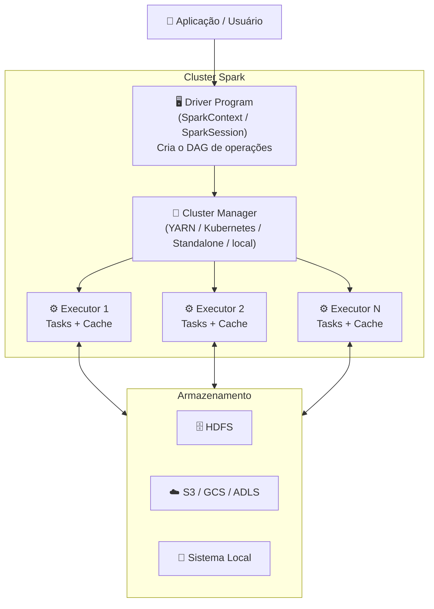
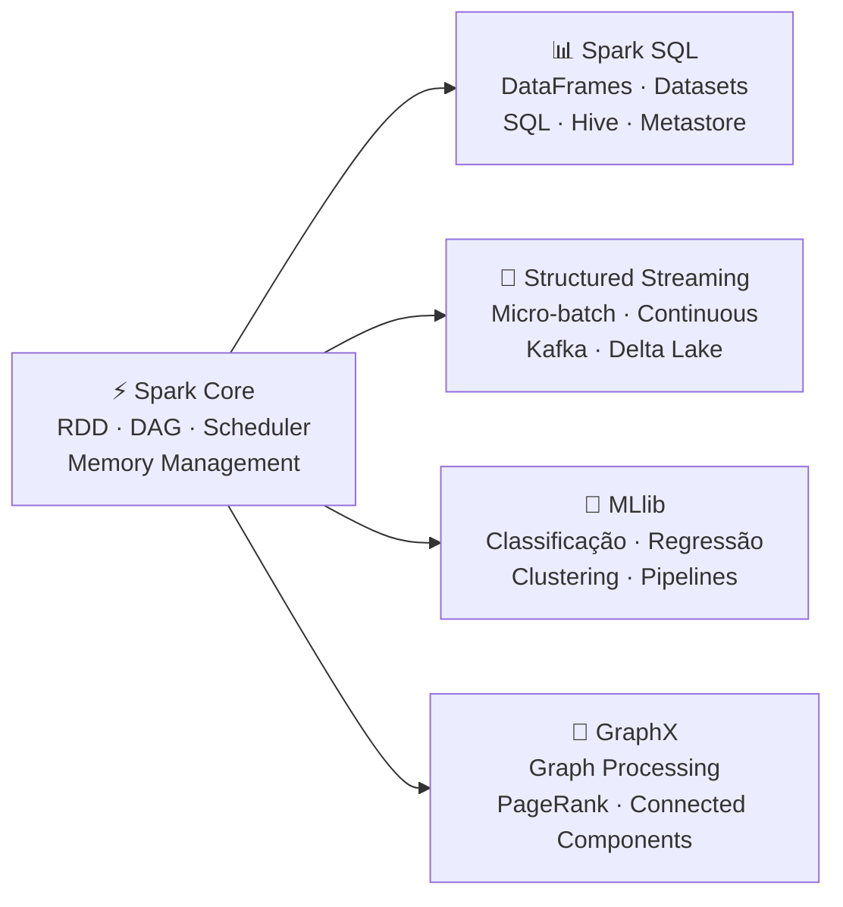
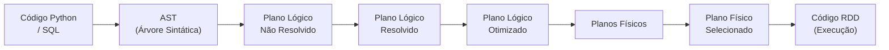

# Apache Spark e PySpark

## O que é o Apache Spark?

O **Apache Spark** é um framework open-source de processamento de dados em larga escala, criado em 2009
no laboratório AMPLab da UC Berkeley e doado à Apache Software Foundation em 2013. É atualmente o motor
de processamento mais popular para Big Data, sendo adotado por empresas como Netflix, Airbnb, Uber e Databricks.

Ao contrário do **Hadoop MapReduce** — que persiste dados em disco a cada etapa do processamento —
o Spark processa dados **em memória (in-memory)**, o que o torna até **100x mais rápido** para
determinados workloads iterativos (como algoritmos de Machine Learning).

---

## Arquitetura do Spark



### Componentes principais

| Componente | Papel |
|------------|-------|
| **Driver Program** | Coordena a execução, converte o código em um DAG de tarefas |
| **Executor** | Processa as tarefas em paralelo e mantém dados em cache na memória |
| **Cluster Manager** | Aloca recursos de CPU e memória aos executores |
| **DAG Scheduler** | Otimiza e divide o DAG em stages e tasks |
| **Task Scheduler** | Distribui as tasks aos executores disponíveis |

---

## Ecossistema Spark



---

## PySpark

O **PySpark** é a API Python do Apache Spark. Ele permite escrever código Python que é traduzido para
operações Spark na JVM. Internamente, usa **Py4J** para a comunicação entre o processo Python e a JVM
onde o Spark executa.

### Por que usar PySpark?

- Sintaxe Python familiar e produtiva para engenheiros e cientistas de dados
- Integração nativa com `pandas`, `numpy`, `scikit-learn`, `matplotlib`
- Suporte completo a SQL via `spark.sql()`
- Ampla adoção na comunidade de Data Engineering e Data Science
- Mesma performance que Scala/Java para operações DataFrame (Catalyst Optimizer)

### Comparação de APIs

```python
from pyspark.sql import SparkSession
from pyspark.sql import functions as F

spark = SparkSession.builder.appName("Exemplo").getOrCreate()

# --- API DataFrame (recomendada) ---
df = spark.read.parquet("dados/")
resultado = (
    df.filter(F.col("preco") > 200000)
      .groupBy("tipo")
      .agg(F.avg("preco").alias("preco_medio"))
      .orderBy("preco_medio", ascending=False)
)
resultado.show()

# --- API SQL (equivalente) ---
df.createOrReplaceTempView("maquinas")
spark.sql("""
    SELECT tipo, AVG(preco) AS preco_medio
    FROM maquinas
    WHERE preco > 200000
    GROUP BY tipo
    ORDER BY preco_medio DESC
""").show()
```

---

## SparkSession

A `SparkSession` é o **ponto de entrada unificado** para todas as funcionalidades do Spark desde a
versão 2.0. Ela encapsula o `SparkContext`, `SQLContext` e `HiveContext` em uma única interface.

```python
from pyspark.sql import SparkSession

spark = (
    SparkSession
    .builder
    .appName("NomeDoApp")           # Nome visível na Spark UI (porta 4040)
    .master("local[*]")             # Onde o Spark vai executar
    .config("chave", "valor")       # Configurações extras (JARs, memória, catálogos)
    .getOrCreate()                  # Cria nova sessão ou reutiliza existente
)

# Encerrar a sessão ao final
spark.stop()
```

### Parâmetros importantes do builder

| Método | Descrição |
|--------|-----------|
| `.appName(str)` | Nome da aplicação (aparece na Spark UI) |
| `.master(str)` | Define o Cluster Manager (ver tabela abaixo) |
| `.config(key, value)` | Propriedade de configuração do Spark |
| `.enableHiveSupport()` | Habilita suporte ao Hive Metastore |
| `.getOrCreate()` | Cria ou reutiliza uma SparkSession ativa |

### Valores para `.master()`

| Valor | Comportamento |
|-------|---------------|
| `local` | 1 thread (sem paralelismo) |
| `local[2]` | 2 threads fixas |
| `local[*]` | Todos os cores disponíveis |
| `yarn` | Cluster Hadoop YARN |
| `k8s://https://...` | Cluster Kubernetes |
| `spark://host:7077` | Cluster Standalone |

---

## Execução Local: `local[*]`

Neste trabalho, o Spark roda em **modo local** — sem necessidade de cluster dedicado.
O parâmetro `local[*]` instrui o Spark a usar **todos os cores** da máquina local,
simulando um ambiente de múltiplos executores em um único processo.

```python
spark = (
    SparkSession
    .builder
    .appName("TrabalhoDeltaLake")
    .master("local[*]")   # ← Usa todos os cores disponíveis
    .getOrCreate()
)

# Verificar configuração
print(f"Master: {spark.sparkContext.master}")          # local[*]
print(f"Cores:  {spark.sparkContext.defaultParallelism}")  # número de cores
```

!!! tip "Modo local vs. Cluster"
    O modo `local[*]` é ideal para **desenvolvimento, testes e trabalhos acadêmicos**.
    Em produção, usamos cluster managers como **YARN** (Hadoop), **Kubernetes** ou **Databricks**.

!!! info "Spark UI"
    Enquanto a SparkSession está ativa, a **Spark UI** fica disponível em
    [http://localhost:4040](http://localhost:4040) para monitorar jobs, stages e tasks.

---

## RDD, DataFrame e Dataset

O Spark oferece três abstrações para representar dados distribuídos:

| Abstração | Nível | Linguagem | Otimização | Uso recomendado |
|-----------|-------|-----------|------------|-----------------|
| **RDD** | Baixo | Python/Scala/Java | Manual | Operações não-tabulares de baixo nível |
| **DataFrame** | Alto | Python/Scala/Java/R | Catalyst Optimizer | Dados tabulares — **uso principal em PySpark** |
| **Dataset** | Alto | Scala/Java | Catalyst + Tungsten | Tipagem estática em Scala/Java |

!!! note "PySpark usa DataFrames"
    Em Python, trabalhamos principalmente com **DataFrames** e **Spark SQL**, que são otimizados
    automaticamente pelo **Catalyst Optimizer** e pelo **Tungsten Execution Engine**.

---

## Catalyst Optimizer

O **Catalyst** é o motor de otimização de queries do Spark SQL. Ele transforma o código Python/SQL
em um plano de execução físico otimizado:



O Catalyst realiza otimizações como **predicate pushdown** (filtros aplicados antes de joins),
**column pruning** (leitura apenas das colunas necessárias) e **join reordering**.
